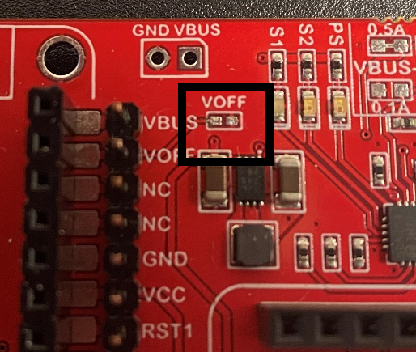
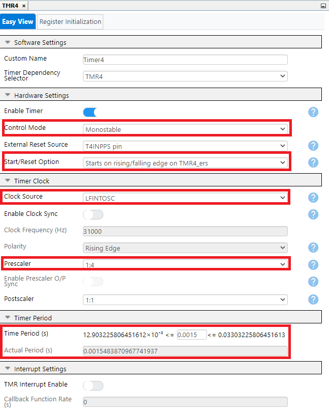

<!-- Please do not change this logo with link -->

[](https://www.microchip.com)

# Analog Sensor Net for PIC18F16Q41 Curiosity Nano

The Analog Sensor Net demo is a modified version of the original [Analog Sensor Net](https://github.com/microchip-pic-avr-examples/pic18f16q41-analog-sensor-net/tree/2.0.0/) for a PIC18F16Q41 on the Curiosity LPC board, which relates to AN3521: Analog Sensor Measurement and Acquisition. This version uses a Curiosity Nano, Baseboard, and MikroE SHT AN, Pressure 13, and Air Quality Click. Additionally, it highlights the use of integrated Core-Independent peripherals such as the ADCC, built in OPAMP, UART, CLC, and several others on the PIC18F16Q41.

__Important Note:__ Each sensor requires a differing interface to function so unique initialization routines are used between each sensor.

## Related Documentation

     In addition a link to the device family landing page and relevant peripheral pages as well:-->
  - [AN3521 - Analog Sensor Measurement and Acquisition](http://microchip.com/00003521/)
  - [Original Analog Sensor Net](https://github.com/microchip-pic-avr-examples/pic18f16q41-analog-sensor-net/tree/2.0.0/)
  - [Switch Debouncing with PIC18F16Q40](https://github.com/microchip-pic-avr-examples/pic18f16q40-clc-switch-debouncing)
  - [PIC18F-Q41 Family Product Page](https://www.microchip.com/en-us/products/microcontrollers-and-microprocessors/8-bit-mcus/pic-mcus/pic18-q41)

## Software Used

  - MPLAB® X IDE 6.0.0 or newer [(microchip.com/mplab/mplab-x-ide)](http://www.microchip.com/mplab/mplab-x-ide)
  - MPLAB XC8 2.40 or a newer compiler [(microchip.com/mplab/compilers)](http://www.microchip.com/mplab/compilers)
  - MPLAB Code Configurator (MCC) 5.1.17 or newer [(microchip.com/mplab/mplab-code-configurator)](https://www.microchip.com/mplab/mplab-code-configurator)
  - MPLAB Code Configurator (MCC) Device Libraries PIC10 / PIC12 / PIC16 / PIC18 MCUs [(microchip.com/mplab/mplab-code-configurator)](https://www.microchip.com/mplab/mplab-code-configurator)
  - Microchip PIC18F-Q Series Device Support (1.14.237) or newer [(packs.download.microchip.com/)](https://packs.download.microchip.com/)

<!-- - MPLAB X IDE 6.0.0 or newer [(MPLAB X IDE 6.0)](https://www.microchip.com/en-us/development-tools-tools-and-software/mplab-x-ide?utm_source=GitHub&utm_medium=TextLink&utm_campaign=MCU8_MMTCha_MPAE_Examples&utm_content=pic18f16q41-nano-analog-sensor-net-mplab-mcc-github)
- MPLAB XC8 2.36.0 or newer compiler [(MPLAB XC8 2.36)](https://www.microchip.com/en-us/development-tools-tools-and-software/mplab-xc-compilers?utm_source=GitHub&utm_medium=TextLink&utm_campaign=MCU8_MMTCha_MPAE_Examples&utm_content=pic18f16q41-nano-analog-sensor-net-mplab-mcc-github) -->

## Hardware Used

  - PIC18F16Q41 Curiosity Nano [(EV26Q64A)](https://www.microchip.com/en-us/development-tool/EV26Q64A)
  - Curiosity Nano Base for Click boards™ [(AC164162)](https://www.microchip.com/Developmenttools/ProductDetails/AC164162)
  - Air Quality Click board™ [(MIKROE-1630)](https://www.mikroe.com/air-quality-click)
  - SHT AN Click board™ [(MIKROE-3984)](https://www.mikroe.com/sht-an-click)
  - Pressure 13 Click board™ [(MIKROE-4294)](https://www.mikroe.com/pressure-13-click)
 

## Setup

### Demo Configuration:

This demo uses the Curiosity Nano Base Board with the PIC18F16Q41 Curiosity Nano. Mikro BUS sockets #1, #2 and #3 on the Base Board are populated by the SHT click board, Air Quality click board, and the Pressure 13 click board respectively.
The Operational Amplifier (OPA) module was used for the analog output of the Air Quality and SHT AN click by connecting them to non-inverting OPAMP pins (OPA1IN+). The Pressure 13 was connected directly to analog input pin RC2 for the ADCC. Additionally, pin RC7 is used as a GPIO output pin to control the chip select line of the SHT AN click, switching between temperature and humidity readings. 

</a>

This code example’s signal connections are summarized in the following table:

Signal| Microcontroller Pin
--- | ---
SHT AN Output (Temperature and Humidity) | RC3
SHT AN GPIO Select | RC7
Pressure 13 Output | RC2
Air Quality Sensor Output | RA2
UART TX | RB7
Switch 0 (SW0) | RC0

Note: If different sockets are being used for different clicks boards, be sure to change the respective pins.

__Important Note:__ The base must be modified to support running the microcontroller at 5V. The board uses the internal charge pumps that supply both 3.3V and 5V to the mikro Bus sockets. However, the curiosity baseboard will pull the “Voff” pin LOW by default and disable the Curiosity Nano’s power supply and use the base board’s 3.3V power supply instead. For this demo to function properly at 5V the user MUST remove the “Voff” and “3v3” jumper resistors from the base.


</a>
</a>

### Peripheral Setup Using MCC:
#### Project Peripherals:
</a>

#### Clock Control:
</a>

Enable the High Frequency Internal Oscillator inside of "Clock Control". This is optional, but ensures the HFINTOSC is always running.
#### Configuration Bits:
</a>

Make sure the "External Oscillator Mode Selection" is set to "Oscillator not enabled"  and that "HFINTOSC with HFFRQ = 4MHz and CDIV = 4:1" is set for "Power-up Default Value for COSC".
#### ADCC Configuration:
</a>

The ADCC should be configured to Burst Average Mode with Continuous Operation to reduce noise on incoming signals. The Burst Average works by accumulating 32 samples, then shifting right by 5 bits to divide that accumulated value by 32 to give an average reading over each batch of 32 samples. The Continuous Operation sets the ADCC to immediately start a new sample acqusition when the prior one completes. This configured ADCC setting will function as a default setting for the ADCC as the application code adjusts ADCC settings during operation.
#### OPAMP Configuration:
</a>

The OPAMP is first configured in "Unity Gain Buffer" mode as a default setting. The OPAMP serves three purposes in this example. The first is to function as an internal multiplexer between multiple analog signals to run into one ADCC channel via an internal connection between the OPAMP and the ADCC. The second is to give the user the ability to buffer the input signals. The third is to adjust the signal gain using the internal resistor ladders in the OPAMP module. This lets the user add flexibility to their design by using a desired signal gain for a specific sensor. The three included sensors in this application have output voltages suitable for the ADCC without additional signal gain, however the user may change the signal gain in the application to read from many different sensors. Similarly to the ADCC, the application will alter OPAMP settings as needed during operation.
#### CLC Configuration:
</a>

</a>

The CLC is used with TMR4 to create a hardware debouncer for the Curiosity Nano's Switch 0 (SW0), which is used to switch between sensors. For more information, see: [Switch Debouncing with PIC18F16Q40](https://github.com/microchip-pic-avr-examples/pic18f16q40-clc-switch-debouncing).
#### TMR4 Configuration:
</a>

TMR4 is running in a Monostable mode as a timer for the CLC's JK flip-flop to create a hardware debouncer for Switch 0. The Time Period should be set to 1.5ms. For more information, see: [Switch Debouncing with PIC18F16Q40](https://github.com/microchip-pic-avr-examples/pic18f16q40-clc-switch-debouncing).
#### UART Configuration:
</a>

</a>

The UART driver is used to display the output from the sensor net in MPLAB Data Visualizer or any terminal emulator using a Baud Rate of 9600. To enable print statements, the user must open the UART peripheral library (UART1PLIB) from the Builder window and enable "Redirect STDIO to UART".
#### Builder:
</a>

#### Pin Grid View:
</a>

Peripheral pins should be assigned as shown in this grid view.
#### Pins:
</a>

Assigned pins should match the pin settings as shown. The application also uses custom names for pins, RC1 was renamed to "SW0" and RC7 was renamed to "SHT_AN_SEL".

### Application Code and Sensor Interface:

#### Application Code:

The main.c implements a state machine to switch between different sensor configurations when the Curiosity Nano's pushbutton is pressed. Part of the case statement is included below as an example:

```C
	switch (currentState) {
            case SENSOR_NET_SPLASH:
                printf("PIC18F16Q41 Sensor Net Application Note \r\n");
                printf("Press button RC0 to cycle through sensor nodes \r\n\n");
                
                currentState = PRESSURE_SENSOR;
                break;

            case MQ135_SENSOR:
                if (InitFlag == 0) {
                    MQ135_Init();
                    InitFlag = 1;
                }
                MQ135_SendData();

                if (SW0_GetValue() == 0){
                    while(SW0_GetValue() == 0){
                        ;
                    }
                    InitFlag = 0;
                    currentState = HUMIDITY_SENSOR;
                }
                break;
``` 

#### SHT AN Interface:

The SHT AN works both as a temperature sensor and a humidity sensor, but has a similar output voltage for both readings, so Identical ADCC/OPAMP settings may be used. By setting pin RC7 as a GPIO output pin and using the custom name "SHT_AN_SEL" in the pin menu of MCC, the user may use SHT_AN_SEL_SetLow() and SHT_AN_SEL_SetHigh() to switch between temperature and humidity respectively. 
For this sensor, the ADCC is configured to receive input from the OPAMP's output which receives its signal from the OPAMP's OPA1IN1+ input on pin RC3. The OPAMP is set to Unity Gain Mode.

```C
void SHT_AN_ADCC_Init(void) {
    // SHT_AN ADCC Sensor Settings  
    ADPCH = 0x93; // ADCC Positive Channel = OPA1OUT; PCH = OPA1IN1+(RC3)
    PIR1bits.ADIF = 0; // Clear ADIF;
    PIE1bits.ADIE = 1; // Enable ADCC Interrupts;
}

void SHT_AN_OPA_Init(void) {
    // SHT_AN OPA Sensor Settings
    OPA1CON2 = 0x02; // NCH = No Connection; PCH = OPA1IN+ (PSS))
    OPA1CON0 = 0x88; // OPA Enabled; Unity Gain Mode;
}

void SHT_AN_Init(void) {
    SHT_AN_ADCC_Init();
    SHT_AN_OPA_Init();
    SHT_AN_SEL_SetLow();
}
```

#### Air Quality Interface:

For the Air Quality click board, the ADCC is configured to receive input from the OPAMP's output which receives its signal from the OPAMP's OPA1IN2+ input on pin RA2. Additionally the OPAMP is set to Unity Gain Mode.

```C
void MQ135_ADCC_Init(void) {
    // MQ135 ADCC Sensor Settings
    ADPCH = 0x82; // ADCC Positive Channel = OPA1OUT; PCH = OPAIN2+(RA2)
    PIR1bits.ADIF = 0; // Clear ADIF;
    PIE1bits.ADIE = 1; // Enable ADCC Interrupts;
}

void MQ135_OPA_Init(void) {
    // MQ135 OPA Sensor Settings
    OPA1CON2 = 0x02; // NCH = No Connection; PCH = OPA1IN+ (PSS))
    OPA1CON0 = 0x88; // OPA Enabled; Unity Gain Mode;
}
```

#### Pressure 13 Interface:

Pressure 13 is connected directly to the same pin as the OPAMP's output, as such the Pressure click may be selected by disabling the OPAMP and configuring the ADCC to read from the RC2 pin.

```C
void PRESSURE_13_ADCC_Init(void) {
    // Pressure_13 ADCC Sensor Settings
    ADPCH = 0x12; // ADCC Positive Channel = ANC2; PCH = RC2 Pin
    PIR1bits.ADIF = 0; // Clear ADIF;
    PIE1bits.ADIE = 1; // Enable ADCC Interrupts;
}

void PRESSURE_13_OPA_Disable(void) { 
    // Pressure_13 OPA Sensor Settings
    OPA1CON2 = 0x00; // NCH = No Connection; PCH = No Connection
    OPA1CON0 = 0x00; // OPA Disabled
}
```

## Operation

UART is used to display the net’s output to MPLAB Data Visualizer with a baud rate of 9600. And the pushbutton on the curiosity is used to switch between sensors. The resulting messages are shown on the terminal window below:  
</a>

## Summary

This example has shown how to use an integrated OPAMP with an ADCC to interface with multiple analog sensors off of a single microcontroller.
