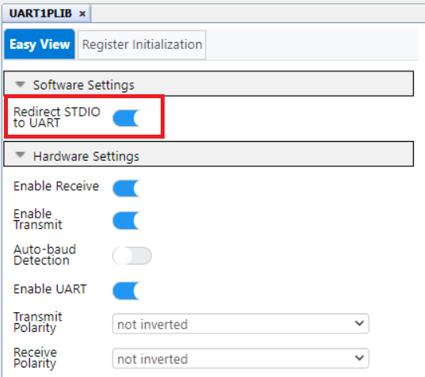

<!-- Please do not change this logo with link -->

# Analog Sensor Net for PIC18F16Q41 Curiousity Nano

<!-- This is where the introduction to the example goes, including mentioning the peripherals used -->
The Analog Sensor Net demo is a modified version of the original Analog Sensor Net for a PIC18F16q41 in a Curiosity LPC board, which relates to AN3521: Analog Sensor Measurement and Acquisition. This version uses a Curiosity Nano, Baseboard, and MikroE SHT AN, Pressure 13, and Air Quality Click. Additionally, it highlights the use of integrated Core-Independent peripherals such as the ADCC, built in OPAMP, UART, CLC, and several others on the PIC18F16Q41.

__Important Note:__ Each sensor requires a differing interface to function so unique initialization routines are used between each sensor.

## Related Documentation

<!-- Any information about an application note or tech brief can be linked here. Use unbreakable links!
     In addition a link to the device family landing page and relevant peripheral pages as well:
  - [AN3381 - Brushless DC Fan Speed Control Using Temperature Input and Tachometer Feedback](https://microchip.com/00003381/)
  - [PIC18F-Q10 Family Product Page](https://www.microchip.com/design-centers/8-bit/pic-mcus/device-selection/pic18f-q10-product-family) -->
  - [AN3521: Analog Sensor Measurement and Acquisition] (http://microchip.com/00003521/)
  - [Original Analog Sensor Net](https://github.com/microchip-pic-avr-examples/pic18f16q41-analog-sensor-net/tree/2.0.0/)
  - [PIC18F-Q41 Family Product Page](https://www.microchip.com/en-us/products/microcontrollers-and-microprocessors/8-bit-mcus/pic-mcus/pic18-q41)

## Software Used

<!-- All software used in this example must be listed here. Use unbreakable links! -->
  - MPLAB® X IDE 6.0.0 or newer [(microchip.com/mplab/mplab-x-ide)](http://www.microchip.com/mplab/mplab-x-ide)
  - MPLAB® XC8 2.36 or a newer compiler [(microchip.com/mplab/compilers)](http://www.microchip.com/mplab/compilers)
  - MPLAB® Code Configurator (MCC) 5.1.2 or newer [(microchip.com/mplab/mplab-code-configurator)](https://www.microchip.com/mplab/mplab-code-configurator)
  - MPLAB® Code Configurator (MCC) Device Libraries PIC10 / PIC12 / PIC16 / PIC18 MCUs [(microchip.com/mplab/mplab-code-configurator)](https://www.microchip.com/mplab/mplab-code-configurator)
  - Microchip PIC18F-Q Series Device Support (1.13.211) or newer [(packs.download.microchip.com/)](https://packs.download.microchip.com/)

<!-- - MPLAB® X IDE 6.0.0 or newer [(MPLAB® X IDE 6.0)](https://www.microchip.com/en-us/development-tools-tools-and-software/mplab-x-ide?utm_source=GitHub&utm_medium=TextLink&utm_campaign=MCU8_MMTCha_MPAE_Examples&utm_content=pic18f16q41-nano-analog-sensor-net-mplab-mcc-github)
- MPLAB® XC8 2.36.0 or newer compiler [(MPLAB® XC8 2.36)](https://www.microchip.com/en-us/development-tools-tools-and-software/mplab-xc-compilers?utm_source=GitHub&utm_medium=TextLink&utm_campaign=MCU8_MMTCha_MPAE_Examples&utm_content=pic18f16q41-nano-analog-sensor-net-mplab-mcc-github) -->

## Hardware Used

<!-- All hardware used in this example must be listed here. Use unbreakable links!
  - PIC18F47Q10 Curiosity Nano [(DM182029)](https://www.microchip.com/Developmenttools/ProductDetails/DM182029)
  - Curiosity Nano Base for Click boards™ [(AC164162)](https://www.microchip.com/Developmenttools/ProductDetails/AC164162)
  - POT Click board™ [(MIKROE-3402)](https://www.mikroe.com/pot-click) -->
  - PIC18F16Q41 Curiosity Nano [(EV26Q64A)](https://www.microchip.com/en-us/development-tool/EV26Q64A)
  - Curiosity Nano Base for Click boards™ [(AC164162)](https://www.microchip.com/Developmenttools/ProductDetails/AC164162)
  - Air Quality Click board™ [(MIKROE-1630)](https://www.mikroe.com/air-quality-click)
  - SHT AN Click board™ [(MIKROE-3984)](https://www.mikroe.com/sht-an-click)
  - Pressure 13 Click board™ [(MIKROE-4294)](https://www.mikroe.com/pressure-13-click)
 

## Setup

<!-- Explain how to connect hardware and set up software. Depending on complexity, step-by-step instructions and/or tables and/or images can be used -->
### Demo Configuration:
[]

This demo uses the curiosity nano base board, a Mikroe SHT AN, Pressure 13, and Air Quality click along with the Curiosity Nano PIC18F16Q41 microcontroller.  Populated on mikro BUS socket #1, #2 and #3 are the SHT click board, Air Quality Click, and the Pressure 13 Click respectively.
The Operational Amplifier (OPA) module was used for the analog output of the Air Quality and SHT AN click by connecting them to non-inverting OPAMP pins (OPA1IN+). The Pressure 13 was connected directly to analog input pin RC2 for the ADCC. Additionally, pin RC7 is used as a GPIO output pin to control the chip select line of the SHT AN click, switching between temperature and humidity readings. 

This code example’s signal connections are summarized in the following table:
!!!
Note: If different sockets are being used for different clicks boards, be sure to change the respective pins.

__Important Note:__ The base must be modified to support running the microcontroller at 5v. The board uses the internal charge pumps that supply both 3.3V and 5V to the mikro Bus sockets. However, the curiosity baseboard will pull the “Voff” pin LOW by default and disable the Curiosity Nano’s power supply and use the base board’s 3.3V power supply instead. For this demo to function properly at 5 volts the user MUST remove the “Voff” and “3v3” jumper resistors from the base.

### Peripheral Setup Using MCC:
#### Project Peripherals:

#### Clock Control:

#### Configuration Bits:

#### ADCC Configuration:

#### CLC Configuration:

#### OPAMP Configuration:

#### TMR4 Configuration:

#### UART Configuration:ADD BOXES!!!

#### Builder:

#### Pin Grid View:ADD BOXES!!!

#### Pins:ADD BOXES!!!

## Operation

<!-- Explain how to operate the example. Depending on complexity, step-by-step instructions and/or tables and/or images can be used -->
UART is used to display the net’s output to MPLAB Data Visualizer with a baud rate of 9600. And the pushbutton on the curiosity is used to switch between sensors. The resulting messages are shown on the terminal window below:  

<!-- ## Summary

 Summarize what the example has shown -->
